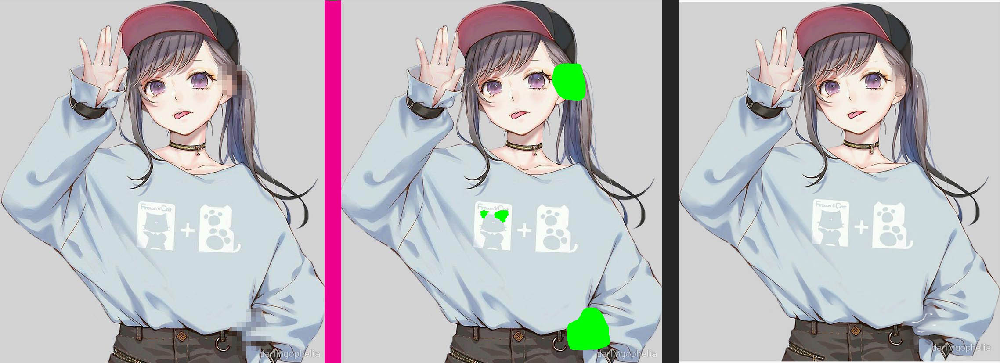
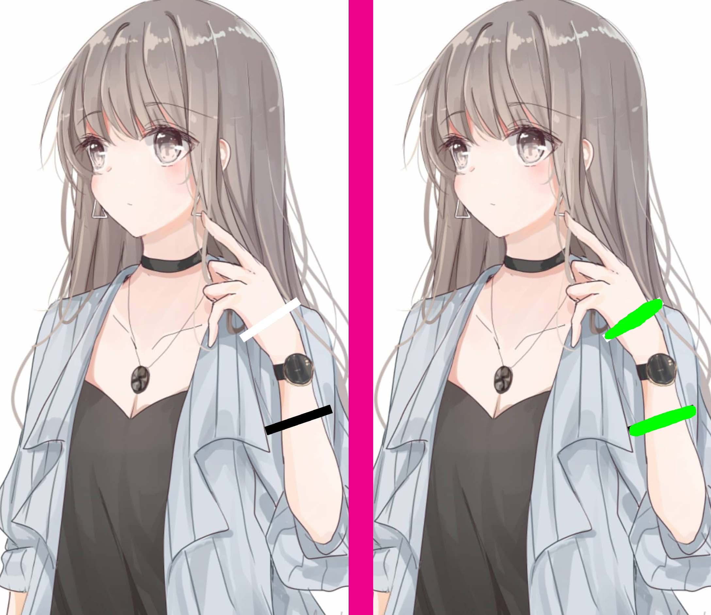
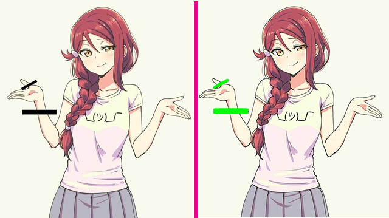

# Detecting censors with deep learning and computer vision

Illustrated adult content created in Japan is required to be censored by law. Two common types of censoring involves censor bars and mosaic blurs. For us degenerates living outside of Japan, this means we are also subject to the bars and mosaics. There is a solution, [DeepCreamPy](https://github.com/deeppomf/DeepCreamPy) by deeppomf that can draw over the censors, given that you tell it where the censors are. That is a long and painstaking process, so I hope to automate that process with this project. This project will utilize deep learning and image segmentation, techniques typically used in autonomous vehicles and computer vision tasks. 

This is an implementation of Matterport's [Mask R-CNN](https://arxiv.org/abs/1703.06870), modified to my liking. 

NOTE: Despite the title, this project does not actually use AI.

Here is a [NSFW Video](https://www.pornhub.com/view_video.php?viewkey=ph5e5bdbbcbce66) that shows better what this project does, on current model 161. 

Development news will be posted on my Twitter (NSFW).
[](https://twitter.com/pecanpie112/)

Like what you see? You can send me a tip! (Proceeds also go to my tuition)
[](https://www.paypal.com/cgi-bin/webscr?cmd=_donations&business=CGF4Q3FK2Q2SU&currency_code=USD&source=url)

Example of mosaic detection on dated (Feb 27,2020) model 107:


Examples of bar detection on datad model 107:




For both of those examples, the newest model 161 provides far more accurate masks and detection.

# Getting Started
You will need all the same requirements as matterport's Mask RCNN implementation, nothing more. Note that I am using tensorflow 1.5.0, tensorflow-gpu 1.9.0, and keras 2.2.0. I have not been able to get newer combinations stable. I use Anaconda3 for my command line.

* [inspect_model.ipynb](samples/coco/inspect_model.ipynb) This notebook is identical to the balloon notebook. I modified it to work with this project instead, and it is best used to inspect a model. For detailed logging, use Tensorboard (which should be installed if you have tensorflow)

* [inspect_weights.ipynb](samples/coco/inspect_weights.ipynb)
Same thing as above, except this notebook is used to validate the dataset. Also has cool information showing some of the quirks and features of MaskRcnn

I have only worked on Windows platforms, and had not been able to train or work on other instances like Google colab and Google Cloud. 


# The Dataset

Extended the existing Balloon class to support 3 classes: BG, bar, and mosaic. I have decided to not provide my dataset. Annotated with VGG annotator in .json format.

The color_splash function will be overwritten to instead return a full green mask over the returned rpn mask. This will ensure compatibility with the DeepCreamPy framework.

# The Model

I experimented with other pre-trained models, but ended transfer learning with the imagenet model. 

I have a prototype model with 45 epochs available [here](https://drive.google.com/open?id=1u8I-oRKxe8Mx8wENVkccliOvSj4MEr45). I will continue adding more trained models as I continue training.

Another model ready for inference is model 107. I will continue training models, and models I am comfortable with will be made available here.

Latest model is model 161, available [here](https://drive.google.com/open?id=1gyP9nIRsJ3pcfjcVLZya1aDVe971wCX4)

Please keep it named as weights.h5

## Requirements
I would reccomend running these on a virtual environment, with Anaconda3.
Python 3.5, TensorFlow 1.5, Keras 2.2, tensorflow-gpu 1.9.0, and other common packages listed in `requirements.txt`.

* For now, DCP is required (mainly because theres nothing else out there like it). This project expects to use the DCP directory. You can install the executable or the source code, either should work.

* Please note that DCP is ONLY compatible with .png images, and not jpg. That should be the first thing you do - convert whatever content you want to decensor to png format. You can use online tools like jpg2png. Again, this should be done before anything else.

* DCP is not compatible with screentones, or that dotted effect that is characteristic of printed works. Simply refer to my other project, [Screentone Remover](https://github.com/natethegreate/Screentone-Remover), which will batch remove screentones using Digital Signal Processing techniques. After running the Screentone Remover, you can detect the censors with hentAI.


## Important Notes (READ BEFORE USING)

* I highly reccommend running hentAI on batches, for example one doujin or a few doujins at once. The slowest part of hentAI is the initialization, so the first inference takes time but the rest will be quick. 

* The current model is not perfect. Yet. Expect some trouble with white censor bars, small censor bars, partially-transparent censor bars, and censor bars that are fused together as one large censor. Any absurd amount of censoring may cause issues for hentAI.

* This model is not trained in recognizing full censorship, where genetalia is not drawn at all. Non-standard censoring is also not supported. 

* The model supports mosaics and bars, but it really struggles when both are used on the same spot. Also, DCP can only generate for bars or mosaics, so you will need to keep mosaic censoring works separate from bar censored works.

* If you choose to try the video detection, PLEASE only do one SHORT clip at a time. More testing is needed with video detection.

* The Video Maker button creates a video from the output of DCP in decensored_output. Run this after DCP completes. Note you still need to select the directories for the source video, and the DCP install directory.

* Do not put entire clips through the video detection, it is a very slow task. If you can, edit in only the clips with visible mosaics, get the decensored output, then edit them in the rest of the video.

## Versions

* v1.0: Initial release for 2020 HackIllinois Demo

* v1.1: Cleaned code, removed unneeded library imports, added install instructions and tutorial. Added error detection.


## Installation directions

For detailed instructions, follow Install_and_Tutorial.txt

NOTE: An executable is in the works. Releasing soon.

* After cloning this repo, first install the requirements:

```
pip install -r requirements.txt
```

* Next, compile maskrcnn:

```
python setup.py install
```

* To run hentAI, run

```
python main.py
```
In the main directory. Follow the UI instructions from there.

* Not needed, but to train, run

```
python samples\hentai\hentai.py train --dataset=dataset_img/ --weights=path/to/weights
```
Alternatively, you can resume training using --weights=last


## Contributing
I only have a bare understanding of convolutional nueral networks and deep learning as a whole. Contributions and improvements to this repo are welcome.


# Acknowledgements

Inspiration from [DeepCreamPy](https://github.com/deeppomf/DeepCreamPy)

Mask Rcnn implementation from [Matterport](https://github.com/matterport/Mask_RCNN)

Obtained weights from mattya's [chainer-DCGAN]( https://github.com/mattya/chainer-DCGAN)

Dataset annotated with [VGG annotator](http://www.robots.ox.ac.uk/~vgg/software/via/via.html)

Dataset created with numerous doujins and hentai
